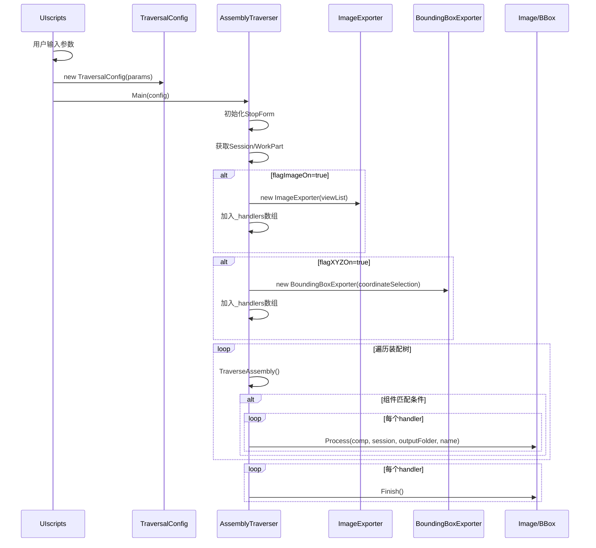
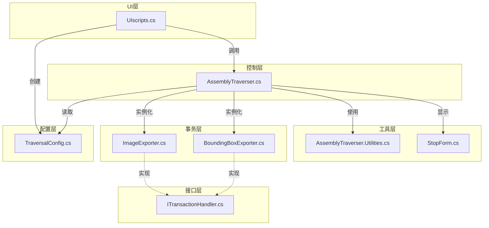

# NXUG自动化迭代工具 - UI配置化重构 Spec

## Why
当前NXUG自动化迭代工具的配置参数（输出路径、过滤条件、视图选择、坐标系模式等）均硬编码在源代码中，每次使用都需要修改源码重新编译。为提高工具的易用性和灵活性，需要将这些参数改为通过UI界面动态配置。

## What Changes

### 新增文件
- **TraversalConfig.cs**: 配置数据类，集中管理所有可配置参数

### 修改文件
- **AssemblyTraverser.cs**: 删除硬编码配置，改为从`TraversalConfig`读取运行时参数
- **ImageExporter.cs**: 删除硬编码`CaptureViews`，改为构造函数注入视图列表
- **BoundingBoxExporter.cs**: 删除硬编码`BoundingBoxCsysMode`，改为构造函数注入坐标系选择
- **UIscripts.cs**: 集成UI界面，收集用户输入并启动遍历
- **README.md**: 更新文档，添加mermaid流程图

### 核心改动
- 将静态配置改为运行时动态配置
- 支持通过UI界面设置参数
- 根据UI选择动态启用/禁用事务处理器

## Impact
- **Affected specs**: 无（首次迭代）
- **Affected code**: 
  - `AssemblyTraverser.cs` - 主程序逻辑
  - `ImageExporter.cs` - 截图事务处理器
  - `BoundingBoxExporter.cs` - 包容体测量事务处理器
  - `UIscripts.cs` - UI入口

## ADDED Requirements

### Requirement: 配置数据类
The system SHALL provide a `TraversalConfig` class to encapsulate all runtime configurable parameters.

#### Scenario: 参数传递
- **WHEN** UI收集用户配置
- **THEN** 创建`TraversalConfig`实例并传递给`AssemblyTraverser`

### Requirement: 动态事务处理器构建
The system SHALL dynamically build the transaction handlers array based on user selections.

#### Scenario: 仅截图
- **WHEN** `flagImageOn=true` AND `flagXYZOn=false`
- **THEN** 仅创建`ImageExporter`实例

#### Scenario: 仅测量
- **WHEN** `flagImageOn=false` AND `flagXYZOn=true`
- **THEN** 仅创建`BoundingBoxExporter`实例

#### Scenario: 两者都启用
- **WHEN** `flagImageOn=true` AND `flagXYZOn=true`
- **THEN** 创建两者实例，按截图→测量顺序执行

### Requirement: 坐标系选择
The system SHALL support WCS/ACS coordinate system selection for bounding box measurement.

#### Scenario: WCS模式
- **WHEN** `coordinateSelection="WCS"`
- **THEN** `BoundingBoxExporter`使用WCS坐标系计算包围盒

#### Scenario: ACS模式
- **WHEN** `coordinateSelection="ACS"`
- **THEN** `BoundingBoxExporter`使用ACS坐标系计算包围盒

### Requirement: 视图选择
The system SHALL support selecting which views to capture for screenshot.

#### Scenario: 多选视图
- **WHEN** 用户选择部分视图（如Top、Front、Isometric）
- **THEN** `ImageExporter`仅截取选中的视图

## MODIFIED Requirements

### Requirement: 主程序入口
The `AssemblyTraverser.Main()` method SHALL accept a `TraversalConfig` parameter instead of using static configuration.

### Requirement: 事务处理器初始化
Transaction handlers (`ImageExporter`, `BoundingBoxExporter`) SHALL accept configuration parameters via constructor injection.

## 执行流程

## 函数输入输出规范

### TraversalConfig 类

| 属性名 | 类型 | 说明 | 默认值 |
|--------|------|------|--------|
| `filePath` | string | 输出文件夹路径 | 空字符串 |
| `namePatterns` | string[] | 名称匹配模式列表 | 空数组 |
| `idPatterns` | string[] | ID匹配模式列表 | 空数组 |
| `flagImageOn` | bool | 是否启用截图 | false |
| `flagXYZOn` | bool | 是否启用测量 | false |
| `viewList` | SnapViewType[] | 截图视图列表 | 空数组 |
| `coordinateSelection` | string | 坐标系选择("WCS"/"ACS") | "ACS" |

### AssemblyTraverser 类

| 方法名 | 输入参数 | 返回值 | 说明 |
|--------|----------|--------|------|
| `Main(TraversalConfig config)` | `config`: 配置对象 | void | 主入口，接收配置对象 |
| `TraverseAssembly(Component comp, UFSession ufSession, Session theSession, int level)` | `comp`: 当前组件, `ufSession`: UF会话, `theSession`: NX会话, `level`: 当前层级 | void | 递归遍历装配树 |

### ImageExporter 类

| 方法名 | 输入参数 | 返回值 | 说明 |
|--------|----------|--------|------|
| `ImageExporter(SnapViewType[] views)` | `views`: 视图类型数组 | 构造函数 | 初始化截图器，指定要截取的视图 |
| `Process(Component comp, Session theSession, string outputFolder, string descriptiveName)` | `comp`: 组件, `theSession`: NX会话, `outputFolder`: 输出路径, `descriptiveName`: 描述名称 | void | 执行截图 |
| `Finish()` | 无 | void | 资源清理 |

### BoundingBoxExporter 类

| 方法名 | 输入参数 | 返回值 | 说明 |
|--------|----------|--------|------|
| `BoundingBoxExporter(string csysMode)` | `csysMode`: 坐标系模式("WCS"/"ACS") | 构造函数 | 初始化测量器，指定坐标系 |
| `Process(Component comp, Session theSession, string outputFolder, string descriptiveName)` | `comp`: 组件, `theSession`: NX会话, `outputFolder`: 输出路径, `descriptiveName`: 描述名称 | void | 执行测量 |
| `Finish()` | 无 | void | 关闭CSV文件 |

### UIscripts 回调函数

| 函数名 | 输入参数 | 返回值 | 说明 |
|--------|----------|--------|------|
| `OnExecute()` | 无 | void | UI按钮点击回调，收集参数并启动遍历 |

## 项目架构图

