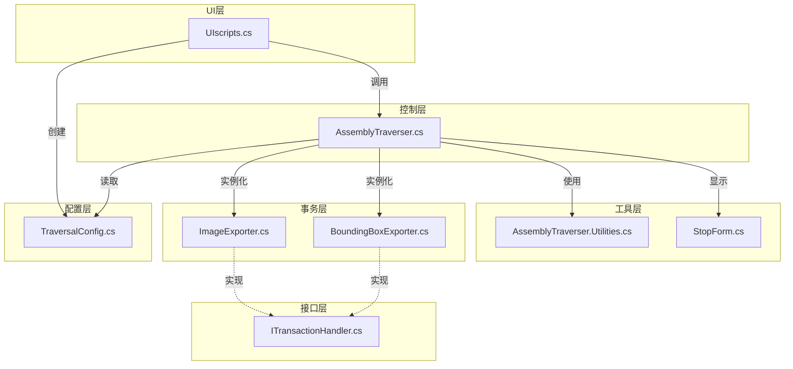
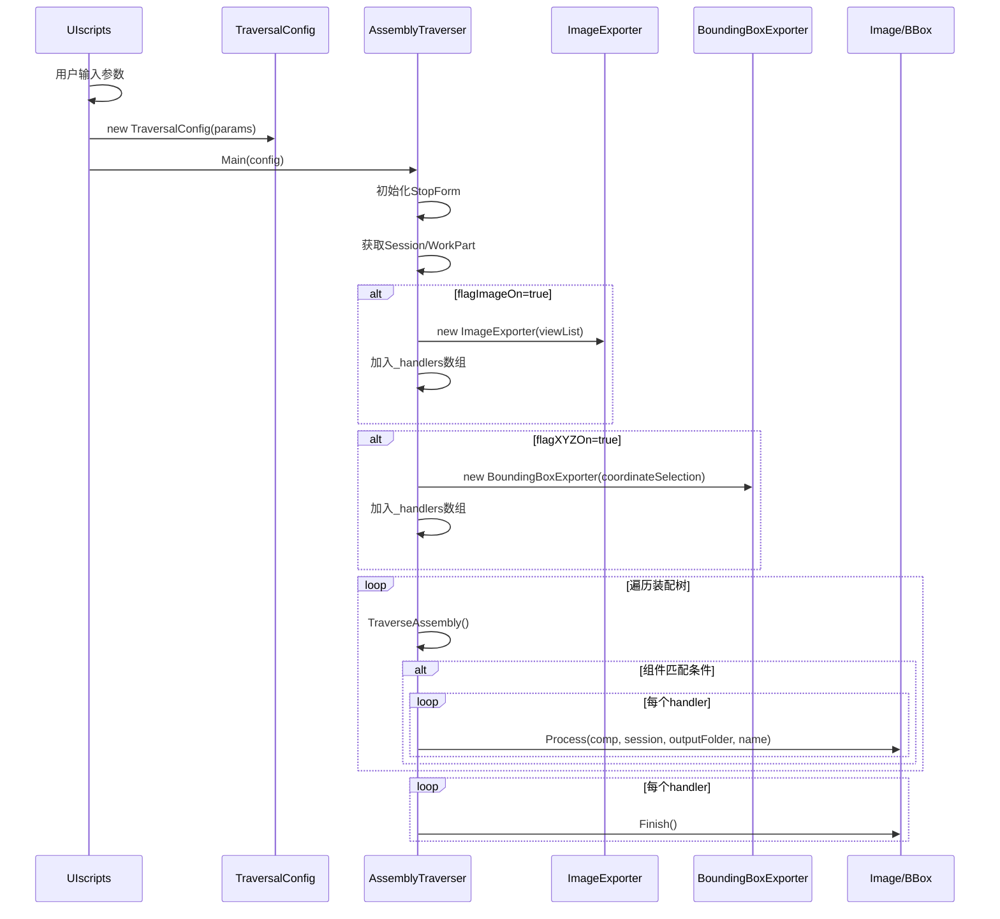

# NX_Traverser
NXUG自动化程序遍历Teamcenter结构树

## 项目简介
这是一个基于NXOpen C# API开发的自动化工具，用于遍历装配结构树并执行多种操作，包括：
- 多视角截图导出（8个标准视角）
- 包容体尺寸测量与CSV导出

## 项目架构



## 执行流程



## 文件说明

| 文件名 | 功能描述 |
|--------|----------|
| [AssemblyTraverser.cs](file:///workspace/AssemblyTraverser.cs) | 主程序，负责装配结构树遍历、过滤和事务调度 |
| [AssemblyTraverser.Utilities.cs](file:///workspace/AssemblyTraverser.Utilities.cs) | 工具类，提供名称获取和通配符匹配功能 |
| [BoundingBoxExporter.cs](file:///workspace/BoundingBoxExporter.cs) | 包容体尺寸导出器，支持ACS/WCS坐标系，导出CSV格式结果 |
| [ImageExporter.cs](file:///workspace/ImageExporter.cs) | 截图导出器，支持8个标准视角的PNG截图 |
| [ITransactionHandler.cs](file:///workspace/ITransactionHandler.cs) | 事务处理器接口，可扩展新功能 |
| [StopForm.cs](file:///workspace/StopForm.cs) | 停止控制窗口 |
| [TraversalConfig.cs](file:///workspace/TraversalConfig.cs) | 配置数据类，集中管理所有可配置参数 |
| [UIscripts.cs](file:///workspace/UIscripts.cs) | UI入口，提供参数配置界面 |

## 主要功能

### 1. 装配结构遍历
- 深度优先递归遍历装配结构树
- 支持最大层级限制
- 支持组件名称/ID通配符过滤
- 自动按需加载组件

### 2. 多视角截图
- 8个标准视角：正等测、斜等测、顶、前、右、后、底、左
- 透明背景PNG格式
- 自动增强边缘
- 支持选择特定视角

### 3. 包容体测量
- 支持ACS（绝对坐标系）和WCS（工作坐标系）
- 精确包围盒计算
- CSV格式导出（零件名,ID,x,y,z）
- 自动过滤异常实体（>1e6尺寸）

## 配置说明

### UI配置参数

| 参数 | 类型 | 说明 | 默认值 |
|------|------|------|--------|
| `filePath` | string | 输出文件夹路径 | 空字符串 |
| `namePatterns` | string[] | 名称匹配模式列表（每行一个模式） | 空数组 |
| `idPatterns` | string[] | ID匹配模式列表（每行一个模式） | 空数组 |
| `flagImageOn` | bool | 是否启用截图功能 | false |
| `flagXYZOn` | bool | 是否启用包容体测量功能 | false |
| `viewList` | SnapViewType[] | 选中的截图视角 | 空数组 |
| `coordinateSelection` | string | 坐标系选择（"WCS"/"ACS"） | "ACS" |

### 通配符匹配规则
- `*` 匹配任意字符序列
- `?` 匹配单个字符
- 示例：`*总成*`, `????-8103020-*`, `气缸*`

## 使用方法

### 通过UI界面配置（推荐）

1. 在NX中打开装配体
2. 运行 `UIscripts.cs`（通过Journal或Shared Library）
3. 在弹出的UI对话框中配置参数：
   - **输出路径**: 设置截图和测量结果的保存目录
   - **名称匹配**: 输入名称过滤条件（每行一个模式）
   - **ID匹配**: 输入ID过滤条件（每行一个模式）
   - **截图设置**: 勾选"启用截图"并选择要截取的视角
   - **测量设置**: 勾选"启用测量"并选择坐标系（WCS/ACS）
4. 点击"确定"或"应用"按钮启动遍历

### 直接调用API

```csharp
TraversalConfig config = new TraversalConfig();
config.filePath = @"D:\output";
config.namePatterns = new string[] { "*总成*" };
config.idPatterns = new string[] { "????-8103020-*" };
config.flagImageOn = true;
config.viewList = new ImageExporter.SnapViewType[] { 
    ImageExporter.SnapViewType.Isometric, 
    ImageExporter.SnapViewType.Top 
};
config.flagXYZOn = true;
config.coordinateSelection = "ACS";

AssemblyTraverser.Main(config);
```

## 错误处理与防错机制

### 运行时防错
- **组件有效性检查**: 在遍历过程中自动检测组件对象是否仍然有效，避免"试图使用不活动的对象"错误
- **只读部件处理**: 通过关闭对话框后再执行遍历，避免只读部件弹窗打断自动化流程
- **空值保护**: 对关键对象和属性访问进行空值检查

### UI输入验证
- 保存地址为空时不允许运行
- 没有任何功能激活时禁止运行
- 未激活截图时禁用视角选择列表
- 激活截图但未选择视角时禁止运行

## 扩展开发

### 添加新的事务处理器

1. 实现 `ITransactionHandler` 接口
2. 在 `AssemblyTraverser.BuildTransactionHandlers()` 方法中添加实例化逻辑
3. 在UI中添加对应的配置控件

### 支持的视图类型

```csharp
public enum SnapViewType
{
    Trimetric,   // 斜等测
    Isometric,   // 正等测
    Top,         // 顶视
    Front,       // 前视
    Right,       // 右视
    Back,        // 后视
    Bottom,      // 底视
    Left         // 左视
}
```

## 版本历史

| 版本 | 日期 | 变更说明 |
|------|------|----------|
| v1.1 | 2026-06 | 添加UI界面支持，支持参数配置 |
| v1.0 | 2026-05 | 初始版本，DLL直接执行模式 |